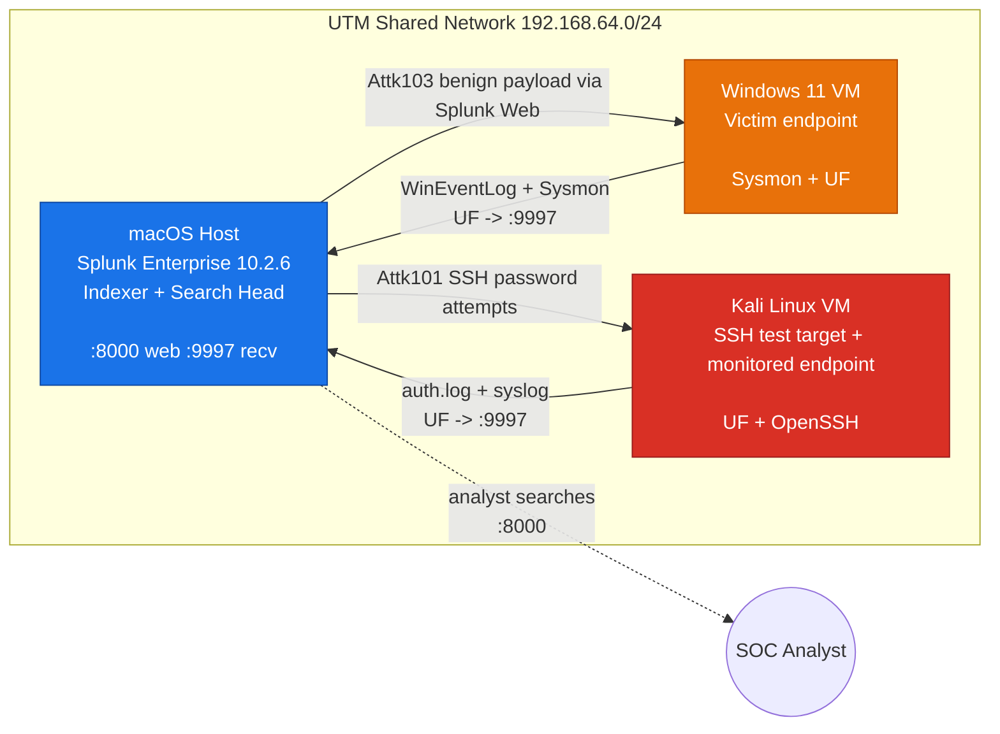

# Architecture / Network Diagram

Copy this into draw.io (or Mermaid) to produce the diagram for the report.

## Mermaid (paste into https://mermaid.live or a draw.io Mermaid shape)

## Node / data-flow description (for the write-up)

| Node | IP | OS | Role | Software | Listening ports |
|------|----|----|------|----------|-----------------|
| macOS host | <mac-ip> | macOS | SIEM manager (indexer + search head + receiver) | Splunk Enterprise 10.2.6 | 8000 (web), 8089 (mgmt), 9997 (receive) |
| Windows 11 VM | <windows-ip> | Win 11 | Victim endpoint | Sysmon (SwiftOnSecurity), Splunk UF | — (outbound only) |
| Kali VM | <kali-ip> | Kali | SSH test target + monitored Linux endpoint | Splunk UF, OpenSSH | 22 (SSH target) |

**Data flows (arrows):**
1. Windows UF → `<mac-ip>:9997` — WinEventLog (Security/System/Application) + Sysmon Operational → index `soc_capstone`.
2. Kali UF → `<mac-ip>:9997` — `/var/log/auth.log` + `/var/log/syslog` → index `soc_capstone`.
3. Mac → Kali : SSH password attempts (Attk101); Mac → Windows Splunk Web: benign PowerShell payload (Attk103).
4. SOC analyst → `http://<mac-ip>:8000` — Splunk searches + dashboard; `http://127.0.0.1:8765` — live trace console.

**Security boundary:** all traffic stays on the UTM 192.168.64.0/24 isolated
virtual network; no exposure to the host's physical LAN/WAN except Splunk
download/update traffic from the Mac.
